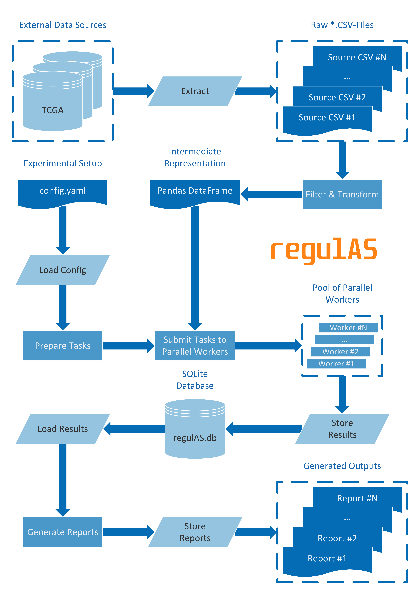
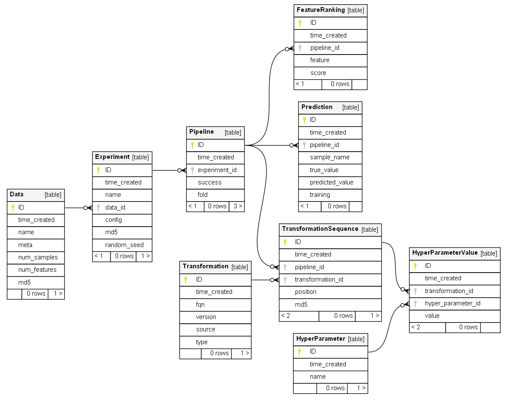

# regulAS
## Machine learning pipeline for identification of alternative splicing regulators in large-scale RNA-seq data

## Overview

**regulAS** is a computational software for analysis of regulatory mechanisms of alternative splicing enabling to 
dissect complex relationships between alternative splicing events and thousands of its prospective regulatory RBPs using large-scale RNA-seq data derived 
from The Cancer Genome Atlas ([TCGA](https://www.cancer.gov/tcga)) and The Genotype-Tissue Expression ([GTEx](http://www.gtexportal.org/)) projects.


**regulAS** is a powerful machine learning experiment management tool written in Python that combines
flexible configuration system based on YAML and shell, fast and reliable data storage
driven by SQLite relational database engine and an extension-friendly API compatible
with `scikit-learn`.

**regulAS** is designed to provide users with a "Low-Code" experiment management solution that is 
dedicated for researchers of alternative splicing regulatory mechanisms to simplify typical data mining and machine learning, allowing them to alleviate the number of the prospective regulators of a splicing event of interest for the further in-depth bioinformatics and experimental analysis.


 

## Structure

**regulAS** is supplied with a set of pre-defined modules that introduce support for data
acquisition, fitting of machine learning models, persistence and export of results.

### Workflow

The **regulAS** package encapsulates ETL-, ML- and report generation workflows.
ETL-workflow includes data Extraction, Transformation and Loading operations,
thus preparing the input for the next step, namely Machine Learning (ML) part.
The ML-workflow incorporates typical modeling-related tasks such as performance evaluation,
hyper-parameter tuning and feature ranking.
The ML-workflow output as well as the experimental setup serves as a source for report
generators that can be run afterwards in order to produce summary of an experiment.



#### Data loading

After the transformation step, **regulAS** loads the data into a [`pandas.DataFrame`](https://pandas.pydata.org/docs/reference/api/pandas.DataFrame.html),
which is a default container to store intermediate results.
Given an additional argument denoting the target for supervised model training,
data loader splits the `DataFrame` into samples and targets that are used by the ML-part.

#### Configuration

Experimental setups are configured through YAML files using [Facebook Hydra](https://hydra.cc/) framework.


#### Evaluation of ML-models

The Machine Learning sub-flow manages hyper-parameter tuning, performance evaluation
and scoring of feature relevance.
To tune hyper-parameters, **regulAS** performs a cross validation procedure that is similar
to the [`scikit-learn`](https://scikit-learn.org) grid search ([GridSearchCV](https://scikit-learn.org/stable/modules/generated/sklearn.model_selection.GridSearchCV.html)).
The model performance evaluation requires comparison of ground truth targets to the actual predictions.
Thus, both true and predicted values are stored into a database that serves as a data source
for performance evaluation reports.
Finally, **regulAS** detects if a model provides information on feature importance
and intercepts this scoring putting it into a database for later analysis.

#### Storing results

**regulAS** tracks and stores a wide variety of experimental data that includes:

 * Dataset description
 * Experimental configuration
 * Actual hyper-parameters
 * Source code for models
 * True and predicted target values
 * Feature importance

Typically, a single experiment is able to provide the management system with several hundred
thousand records, which makes storing them a non-trivial task.
To address this challenge, **regulAS** relies on a relational database
powered by the [SQLite](https://www.sqlite.org) engine.
The use of the SQLite database ensures data integrity and provides fast and reliable storage for it.

#### Report generation
The report generation workflow allows assembling results and summarizing them in an appropriate
way (e.g., text- or image-based output).
Moreover, the reports can be chained such as the output of a preceding report is fed into
the next one depending on it.

### Configuration
How to use YAML configuration files and (optionally) combine them with command line arguments.

A single experimental setup defines a scope named `experiment` that encapsulates
the following sub-scopes:

 * `name` &ndash; name of the experiment
 * `dataset` &ndash; configuration of a data source
 * `split` &ndash; cross validation parameters
 * `pipelines` &ndash; list of ML-configurations to compare
 * `reports` &ndash; data export configurations

Using Facebook Hydra framework, **regulAS** provides the ability to override configuration
keys from the command line, to define required-in-runtime arguments (using reserved value `???`)
and to substitute values given a key to another field of a configuration file (`${experiment.another_field}`).

#### Sample experimental setup

**regulAS** configuration can define model evaluation tasks only, while keeping the list
of reports empty.

<details>
  <summary><i>experiment_tasks.yaml</i></summary>

``` YAML
name: lr_svr_tmr

dataset:
  _target_: regulAS.utils.PickleLoader
  name: RNA-Seq
  meta: some fancy description
  path_to_file: ???
  objective: psi

split:
  _target_: sklearn.model_selection.ShuffleSplit
  n_splits: 5
  test_size: 0.2
  train_size: null
  random_state: ${random_state}

pipelines:
  - transformations:
      ZScore:
        _target_: sklearn.preprocessing.StandardScaler
    model:
      LinearRegression:
        _target_: sklearn.linear_model.ElasticNet
        l1_ratio: 0.2
        _varargs_:
          alpha: [0.1, 0.5, 1.0]

  - transformations:
      MinMax:
        _target_: sklearn.preprocessing.MinMaxScaler
    model:
      SupportVectorMachine:
        _target_: sklearn.svm.SVR
        kernel: linear
        _varargs_:
          C: [0.1, 0.5, 1.0]

reports: null
```

</details>

#### Sample report setup

Similarly, there can be only report tasks defined in the experimental setup.

<details>
  <summary><i>report_tasks.yaml</i></summary>

``` YAML
name: lr_svr_tmr

dataset: null
split: null
pipelines: null

reports:
  MSE:
    _target_: regulAS.reports.ModelPerformanceReport
    experiment_name: ${experiment.name}
    loss_fn: sklearn.metrics.mean_squared_error

  PearsonR:
    _target_: regulAS.reports.ModelPerformanceReport
    experiment_name: ${experiment.name}
    score_fn: scipy.stats.pearsonr

  FeatureRanking:
    _depends_on_: ["MSE"]
    _target_: regulAS.reports.FeatureRankingReport
    experiment_name: ${experiment.name}
    sort_by: "${experiment.reports.MSE.loss_fn}:test:mean"
    sort_ascending: true
    top_k_models: 3
    top_k_features: null

  PerformanceCSV:
    _depends_on_: ["MSE", "PearsonR"]
    _target_: regulAS.reports.ExportCSV
    output_dir: reports
    sep: ";"

  RankingCSV:
    _depends_on_: ["FeatureRanking"]
    _target_: regulAS.reports.ExportCSV
    output_dir: reports
    sep: ";"
```

</details>

### Database

Database structure is dedicated to reliably store experimental results and to serve
as a data source for reports based on its contents.
Schema of the **regulAS**' database was designed to preserve consistency and to
minimize redundancy of the stored records.
The database includes the following tables:

 * `Experiment` &ndash; contains high-level summary of the experiments
 * `Data` &ndash; contains details on the dataset used in `Experiment`
 * `Pipeline` &ndash; contains high-level summary on specific pipelines used in `Experiment`
 * `Transformation` &ndash; contains details on ML-models and transformations
 * `HyperParameter` &ndash; contains hyper-parameters of models
 * `Prediction` &ndash; contains true and predicted values for target
 * `FeatureRanking` &ndash; contains feature importance scores
 * `TransformationSequence` &ndash; contains details on the use of models and transformations
 * `HyperParameterValue` &ndash; contains details on the specific values of hyper-parameters



## Usage

In order to use **regulAS** for experimental management, user should define a project directory
containing YAML configuration files and data if necessary.
The experiment then can be run from the command line.

``` Bash
# install regulAS package from PyPi
pip install regulAS
# navigate to the user's project folder
cd /path/to/the/project
# run the experimental setup on different dataset files
python -m regulAS.app --multirun \
experiment=experiments/experiment_tasks \
+dataset.path_to_file=data/data_gtex.pkl,data/data_tcga.pkl
```

After **regulAS** finishes all the tasks, an SQLite database file `regulAS.db` will be stored
in the project directory as well as the reports if any was submitted to generate.
